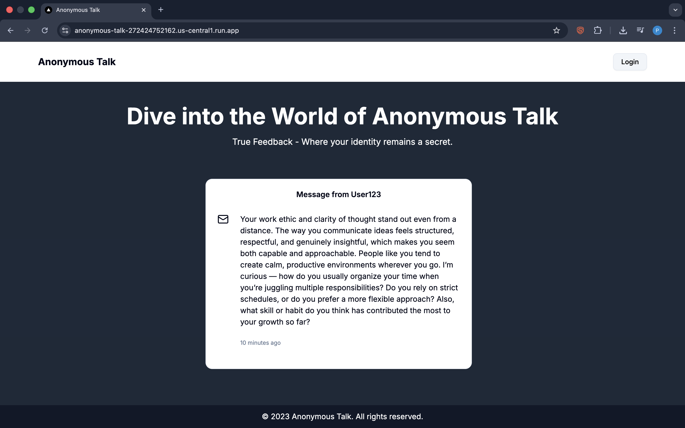
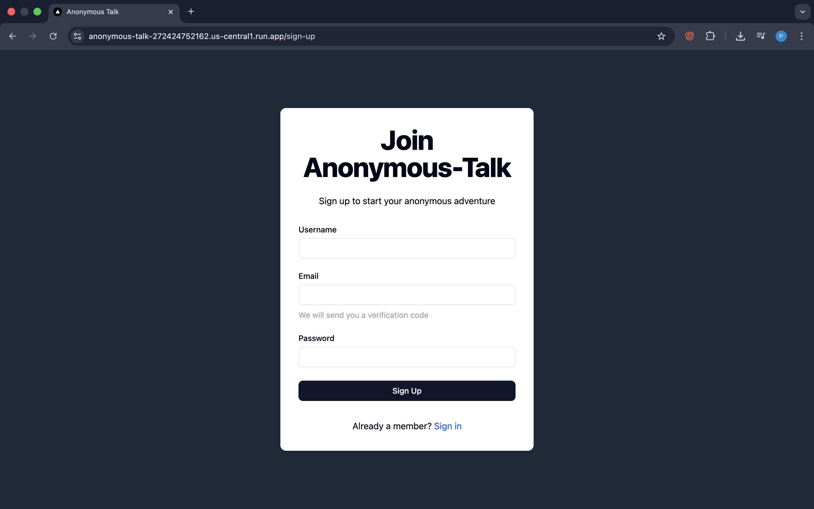
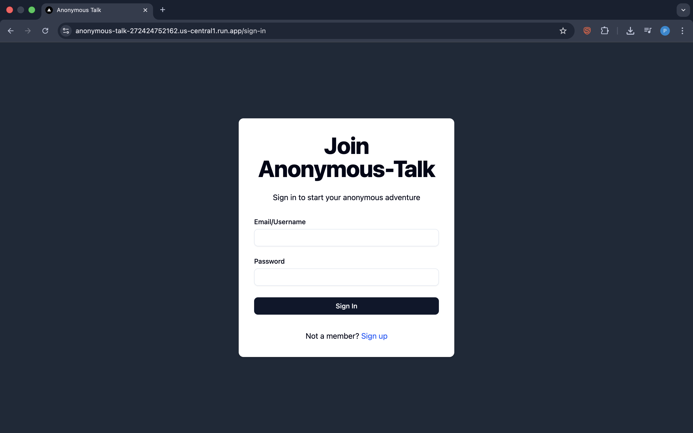
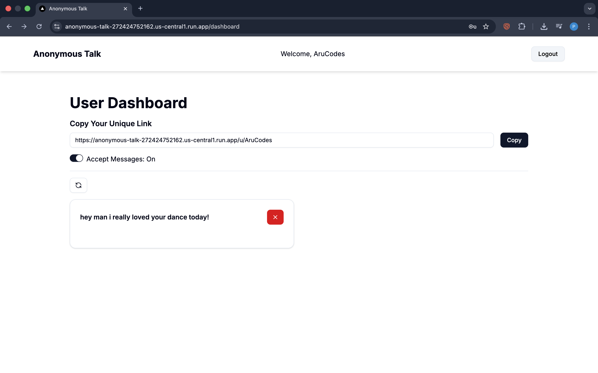
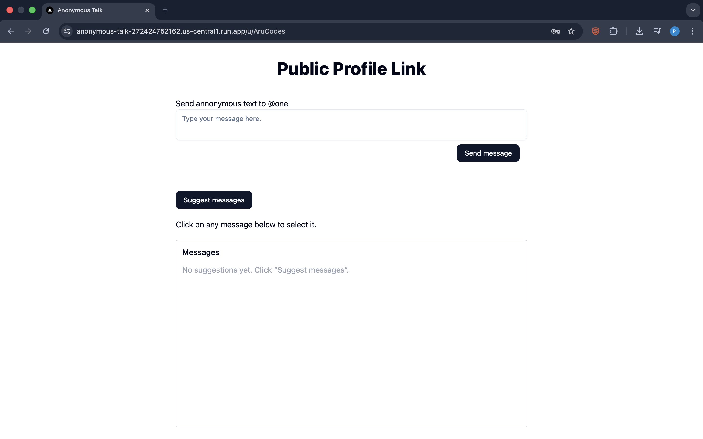
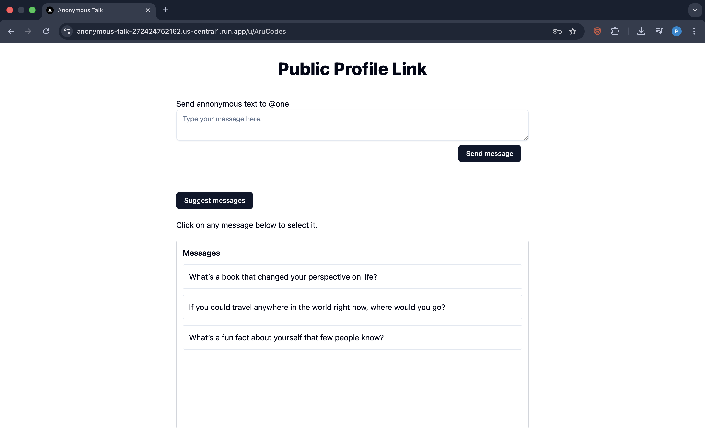
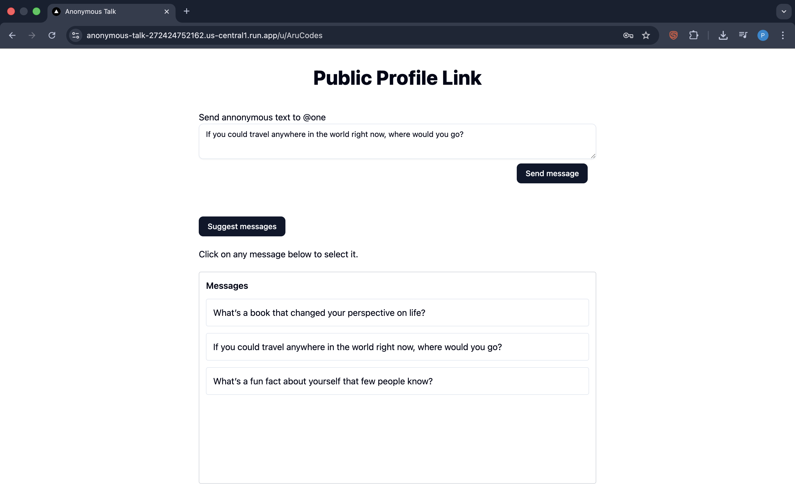

# Anonymous Talk

Anonymous Talk is a Next.js-based web application that allows users to receive anonymous messages. It features user authentication, message management, and email verification, all built with a modern, scalable architecture.

## Features

- **Anonymous Messaging:** Users can receive messages from anyone without revealing the sender's identity.
- **User Authentication:** Secure sign-up, sign-in, and email verification using NextAuth.js.
- **Dashboard:** Personalized dashboard for users to view and manage received messages.
- **Username Uniqueness:** Real-time username availability checks during sign-up.
- **Email Verification:** Users must verify their email to activate their account.
- **API Routes:** RESTful API endpoints for all major actions (send, receive, delete, verify, etc.).
- **Modern UI:** Built with reusable React components and Tailwind CSS for a clean, responsive design.
- **Docker Support:** Ready-to-deploy with Docker and Docker Compose.
- **Cloud Deployment:** Easily deployable to Google Cloud Run using the provided Docker and cloudbuild.yaml configuration for scalable, serverless hosting on GCP.

## Project Structure

```
anonymous-talk/
  ├── emails/                # Email templates (e.g., verification)
  ├── public/                # Static assets
  ├── src/
  │   ├── app/               # Next.js app directory (routing, layouts, pages)
  │   ├── components/        # Reusable UI components
  │   ├── context/           # React context providers
  │   ├── helpers/           # Utility/helper functions
  │   ├── lib/               # Library code (DB, email, utils)
  │   ├── models/            # Mongoose models
  │   ├── Schemas/           # Zod validation schemas
  │   ├── types/             # TypeScript types
  │   └── messages.json      # Static messages
  ├── .env.sample            # Example environment variables
  ├── cloudbuild.yaml        # Cloudbuild config
  ├── docker-compose.yaml    # Docker Compose config
  ├── Dockerfile             # Docker build config
  ├── package.json           # Project dependencies and scripts
  └── README.md              # Project documentation
```

## Getting Started

### Prerequisites

- [Node.js](https://nodejs.org/) (v18+ recommended)
- [Yarn](https://yarnpkg.com/) or [npm](https://www.npmjs.com/)
- [MongoDB](https://www.mongodb.com/) instance (cloud)

## 🛠️ Tech Stack

| Technology | Description |
|------------|-------------|
| Next.js | Frontend framework |
| React/Shadcn | UI library |
| Node.js | Backend |
| Google Cloud Platform | Deployment |

## Demo
- Home Page 

---
- Signup Page

---
- Login Page

---
- Profile Dashboard

---
- UI for sending Message

---
- UI when you click on suggest Message

---
-UI when you click on any message from suggestions

---

### Installation

1. **Clone the repository:**
	```bash
	git clone <repo-url>
	cd anonymous-talk
	```
2. **Install dependencies:**
	```bash
	yarn install
	# or
	npm install
	```
3. **Configure environment variables:**
	- Copy `.env.sample` to `.env` and fill in the required values.
	```bash
	cp .env.sample .env
	```
	- Set up MongoDB URI, NextAuth secrets, email provider credentials, etc.

### Running Locally

```bash
yarn dev
# or
npm run dev
```
The app will be available at [http://localhost:3000](http://localhost:3000).

### Docker

To run the app with Docker:

```bash
docker-compose up --build
```
The app will be available at [http://localhost:3000](http://localhost:3000).

## Deployment

You can deploy this app to any platform that supports Node.js and MongoDB, such as Vercel, AWS, or GCP. For cloud builds, see `cloudbuild.yaml`.

## Environment Variables

See `.env.sample` for all required environment variables, including:

- `MONGODB_URI` - MongoDB connection string
- `NEXTAUTH_SECRET` - Secret for NextAuth.js
- `EMAIL_SERVER_*` - SMTP settings for email verification
- `NEXT_PUBLIC_BASE_URL` - Base URL for the app

## Scripts

- `dev` - Start the development server
- `build` - Build the app for production
- `start` - Start the production server
- `lint` - Run ESLint

## License

MIT

---
*Built with Next.js, TypeScript, and ❤️*

